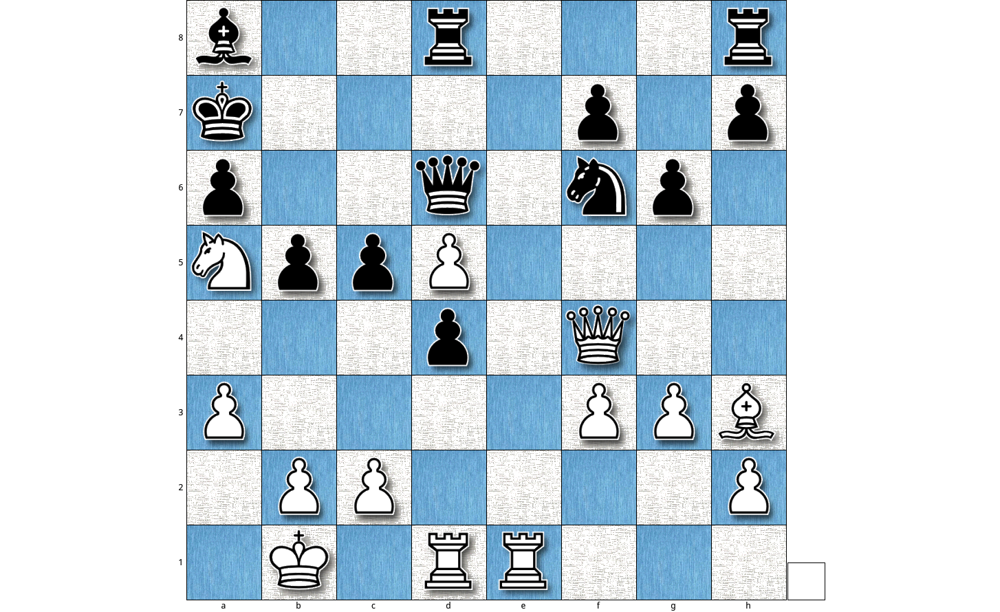

[](https://travis-ci.org/CYHSM/chess-surprise-analysis)
[](https://github.com/CYHSM/chess-surprise-analysis/blob/master/LICENSE.md)


## The -What The Hell- Moment

When looking at specific chess games from grandmasters there sometimes comes a point in the game where a lot of people
wonder about a horrible looking move (mostly a sacrifice of a high valued piece) and why it was played this way.

Analysing these games with an engine (usually) reveals the genius behind these moves and the advantage this move offers, but from the engines perspective this move was not *surprising* at all.

This repository implements a Surprise Analysis of Chess Games. The key concept is to compare the evaluations of a chess engine in low depths with the evaluation at high depths, with the idea that a low depth engine may represent a naive observer of the game. It uses the super-strong open-source engine [Stockfish](https://stockfishchess.org/) and the awesome [python-chess library](https://github.com/niklasf/python-chess).

## Example Usage
Start with a chess game. Most of them are available as .pgn files, so just specify the file to your specific chess game:
```python
# Load Game from PGN
path_to_pgn = 'wei_yi_bruzon_batista_2015.pgn'
chess_game = csa.load_game_from_pgn(path_to_pgn)
```
Then evaluate the game. With the halfmove_numbers parameter you can specify which moves should be evaluated and with the depths you control the depth of analysis.
```python
# Evaluate Game
cp, nodes = csa.evaluate_game(chess_game, bln_reset_engine=True,
                              halfmove_numbers=None, depths=range(1, 35),
                              verbose=1, async_callback=True)
```
After evaluating all depths for all moves (this could take some time) find surprising moves:
```python
# Find surprising moves
ss_df, infos = csa.analyse_evaluations(cp, low=12, high=22)
```

## Example 1

I evaluated Garry Kasparovs immortal game against Veselin Topalov until depth 32. In this game Kasparov was trailing a bit and in the following position Kasparov decided to go all in and play Rxd4, which is of course quite a natural move to play in this position.

<p align="center"></p>

Here is a heatmap showing the centipawn evaluation until depth 32. The y-axis has increasing depth values from bottom to top and the x-axis contains the halfmove numbers from left to right. Colors represent the truncated evaluation in centipawns. Surprising moves are characterised as having a different evaluation for low depths in relation to high depths (see blue parts down and red top, around move 48).

<p align="center"></p>

## Example 2

The game of Wei Yi playing against Bruzon Batista in 2015. See red parts top after move 41. 

<p align="center"></p>

## Limitations

* Using a synchronous calculating approach for each depth will lead to continuous evaluations but with a worse run-time. It can also lead to a high variance in the evaluations at depths < 10.

* Using an asynchronous approach where missing evaluations are filled with the values before and after makes the evaluation much faster. Also missing evaluations are unlikely at depths > 10.
