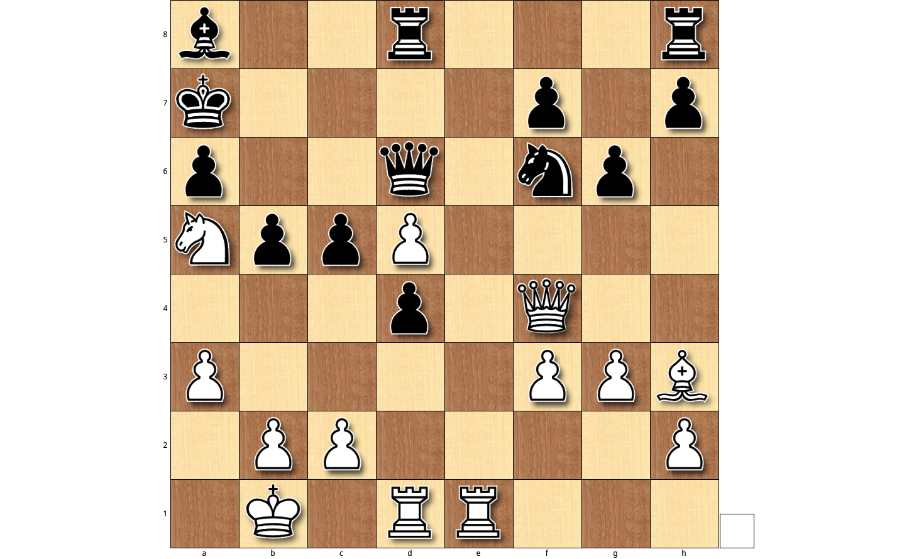

[](https://travis-ci.org/CYHSM/chess-surprise-analysis)
[](https://github.com/CYHSM/chess-surprise-analysis/blob/master/LICENSE.md)


# ----------------------------------------------

# Update on Alpha Zero

The world of chess changed considerably after the introduction of AlphaZero to chess. As described [here](https://arxiv.org/abs/1712.01815) the DeepMind engine won a competition against Stockfish 8 (28 wins - 72 draws - 0 losses). As this library was set out to discover surprising moves in chess games (see below for [describtion](#DescriptionHeader) and [examples](#Example1Header)), I wanted to see if a reanalysis on the games of AlphaZero with the same engine brought some inside into the thought process of [Stockfish 8](https://stockfishchess.org/).

### Game 10
In game 10 there were probably a lot of surprising moves but one of the most daring moves was move 19 by white (AlphaZero). In this position it decided not to save its knight (Ng4) but to play Re1.

<p align="center"></p>

After analysing the game with this library we get this heatmap which shows us the evaluations of Stockfish 8 over each depth for each half-move.

<p align="center"></p>

As one can see move 19 was also surprising to Stockfish (half-move number 38) where even for very high depths it still believed his position to be advantageous. The first time Stockfish actually saw a superior position of AlphaZero was at half-move 65.

Another comment was about the version of Stockfish used, so I reran the analysis on the newest Stockfish build, downloaded from [here](http://abrok.eu/stockfish/).

<p align="center"></p>

There are some differences but this still suggests that around move 18,19 (half-move 36,37,38) the newest version of Stockfish still thought himself to be better.

### Game 1

<p align="center"></p>


### Other AlphaZero games
I plan to add all the games which are available between these engines over the next weeks. Let me know if you have a strong preference for a game to be added.

# ----------------------------------------------


## <a name="DescriptionHeader"></a>The -What The Hell- Moment

When looking at specific chess games from grandmasters there sometimes comes a point in the game where a lot of people
wonder about a horrible looking move (mostly a sacrifice of a high valued piece) and why it was played this way.

Analysing these games with an engine (usually) reveals the genius behind these moves and the advantage this move offers, but from the engine's perspective this move was not *surprising* at all.

This repository implements a Surprise Analysis of Chess Games. The key concept is to compare the evaluations of a chess engine in low depths with the evaluation at high depths, with the idea that a low depth engine may represent a naive observer of the game. It uses the super-strong open-source engine [Stockfish](https://stockfishchess.org/) and the awesome [python-chess library](https://github.com/niklasf/python-chess).

## Example Usage
```python
# Load Game from PGN
path_to_pgn = 'wei_yi_bruzon_batista_2015.pgn'
chess_game = csa.load_game_from_pgn(path_to_pgn)
# Evaluate Game
cp, nodes = csa.evaluate_game(chess_game, bln_reset_engine=True,
                              halfmove_numbers=None, depths=range(1, 35),
                              verbose=1, async_callback=True)
# Save cp
csa.save_evaluation(cp, nodes, depths, True,
                    True, 'wei_yi_bruzon_batista_2015')
# Plot heatmap
csa.plot_cp(cp, fn='wei_yi_bruzon_batista_2015.svg', save=True)

# Find surprising moves
ss_df, infos = csa.analyse_evaluations(cp, low=12, high=22)
```

## <a name="Example1Header"></a>Example 1

I evaluated Garry Kasparov's immortal game against Veselin Topalov until depth 32. In this game Kasparov was trailing a bit and in the following position Kasparov decided to go all in and play Rxd4, which is of course quite a natural move to play in this position.

<p align="center"></p>

Here is a heatmap showing the centipawn evaluation until depth 32. The y-axis has increasing depth values from bottom to top and the x-axis contains the halfmove numbers from left to right. Colors represent the truncated evaluation in centipawns. Surprising moves are characterised as having a different evaluation for low depths in relation to high depths (see blue parts down and red top, around move 48).

<p align="center"></p>

## Example 2

The game of Wei Yi playing against Bruzon Batista in 2015. See red parts on top after move 41.

<p align="center"></p>

## Limitations

* Using a synchronous calculating approach for each depth will lead to continuous evaluations but with a worse run-time. It can also lead to a high variance in the evaluations at depths < 10.

* Using an asynchronous approach where missing evaluations are filled with the values before and after makes the evaluation much faster. Also missing evaluations are unlikely at depths > 10.
