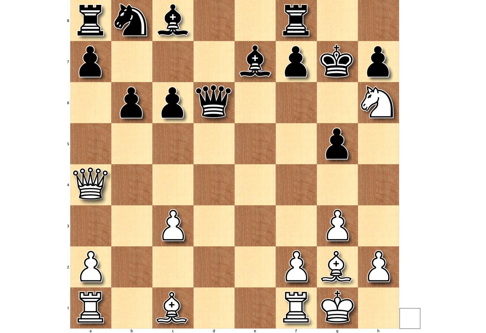

# Alpha Zero Chess

The world of chess changed considerably after the introduction of AlphaZero to chess. As described [here](https://arxiv.org/abs/1712.01815) the DeepMind engine won a competition against Stockfish 8 (28 wins - 72 draws - 0 losses). As this library was set out to discover surprising moves in chess games (see [here](https://github.com/CYHSM/chess-surprise-analysis) for an introduction to the library), I wanted to see if a reanalysis on the games of AlphaZero with the same engine brought some inside into the thought process of [Stockfish 8](https://stockfishchess.org/) (UPDATE: Now all evaluations are done with Stockfish 9).

### Game 1

### Game 2

### Game 3

### Game 4

### Game 5

### Game 6

### Game 7

### Game 8

### Game 9

### Game 10

One of the more interesting games. A very daring move by AlphaZero (White) at move 19. In this position AZ decided not to save its knight (Ng4) but to play Re1.

After analysing the game with this library we get this heatmap which shows us the evaluations of Stockfish 8 over each depth for each half-move:

As one can see move 19 was also "surprising" to Stockfish (half-move number 38) where even for very high depths it still believed his position to be advantageous. The first time Stockfish actually saw a superior position of AlphaZero was at half-move 67.

For comparison, below is the original analysis with Stockfish 8: 

# ----------------------------------------------
